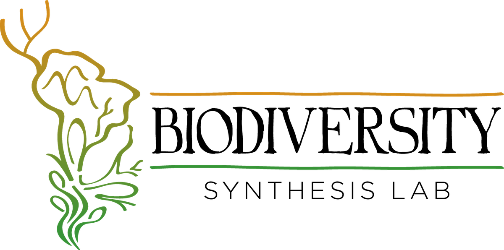

::: {.lab-hero-logo}
{.hero-logo fig-alt="Biodiversity Synthesis Lab logo"}
:::

::: {.lab-welcome}

# Welcome to the Biodiversity Synthesis Lab

**We study the causes and consequences of changes in species diversity to
metacommunity structure and ecosystem functioning.** Using freshwater
organisms — mostly tadpoles and aquatic invertebrates — we combine field
work, computer simulation, statistical modelling, and lab experiments to
promote *synthesis across levels of biological organization* to understand
species coexistence.

We work at the Instituto de Biociências of the **Universidade Federal de Mato
Grosso do Sul (UFMS)** in Campo Grande, Brazil, and we're committed to
excellence — favoring quality over quantity in everything we do.

[Read more about our research →](research.qmd){.btn .btn-outline-primary}
[Meet the team →](people.qmd){.btn .btn-outline-primary}
[Join us →](opportunities.qmd){.btn .btn-outline-primary}

:::

## Lab news

::: {#latest-news}
:::

[See all news →](news/)

## Where to find us

[Instituto de Biociências](https://inbio.ufms.br) · Universidade Federal de
Mato Grosso do Sul · Cidade Universitária, 79002-970 · Campo Grande, Mato
Grosso do Sul, Brazil.

E-mail: `diogo.provete[at]ufms.br`

> "[Theory](http://plato.stanford.edu/entries/science-theory-observation/)
> without [Fact](http://plato.stanford.edu/entries/facts/) is phantasy; but
> Fact without Theory is chaos. Divorced, both are useless; united, they are
> equally essential and fruitful."
>
> — **Charles Otis Whitman (1894)**, *[Evolution and Epigenesis](https://www.biodiversitylibrary.org/item/27273#page/221/mode/1up).
> Biological Lectures, Marine Biological Laboratory, Wood's Holl*, p. 205–24.
