## Principal Investigator

::: {.pi-block}
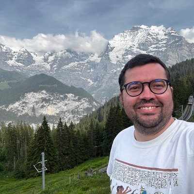

::: {}

Prof. Dr. Diogo B. Provete

Associate Professor · Head of Lab

Diogo obtained his Bachelor's in Biological Sciences at the [Federal
University of Alfenas (UNIFAL)](http://www.unifal-mg.edu.br/) in 2006, his
Master's in Animal Biology at the [São Paulo State University
(UNESP)](http://www.unesp.br/eng) in 2010, and his PhD in Ecology and
Evolution from the [Federal University of Goiás
(UFG)](http://www.ufg.br/page.php) in 2015. He then spent six months as a
guest post-doctoral fellow at the [Antonelli lab](http://antonelli-lab.net)
(University of Gothenburg, Sweden) and eight months as a FAPESP post-doctoral
fellow at the Federal University of São Carlos at Sorocaba in the lab of
Fernando R. Silva. He joined the Institute of Biosciences of UFMS in
September 2017.

::: {.social-links}
[ Email](mailto:diogo.provete@ufms.br)
[ CV (EN)](assets/cv.pdf)
[<i class="ai ai-lattes"></i> Lattes](http://lattes.cnpq.br/9194853434437963)
[<i class="ai ai-academia"></i> Academic Tree](https://academictree.org/evolution/tree.php?pid=688023)
[<i class="ai ai-google-scholar"></i> Scholar](https://scholar.google.com.br/citations?user=qDwcLvIAAAAJ)
[<i class="ai ai-orcid"></i> ORCID](https://orcid.org/0000-0002-0097-0651)
[<i class="ai ai-researchgate"></i> ResearchGate](https://www.researchgate.net/profile/Diogo-Provete)
[ GitHub](https://github.com/diogoprov)
:::
:::
:::

## Current members

::: {.people-grid}

::: {.person-card}
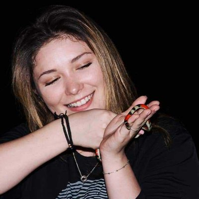

Ana Paula Andreazzi

PhD student · Biologia Animal

How the Urban Heat Island is changing phenotypic traits and
honey biochemistry of stingless bees.

<a href="http://lattes.cnpq.br/7233480915811512" title="Lattes CV"><i class="ai ai-lattes"></i></a>

:::

::: {.person-card}
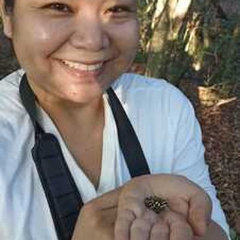

Daiene L. Hokama Souza

PhD student · Ecologia e Conservação

Ecoacoustics and CNN-based species recognition for Pantanal
frog metacommunities.

<a href="http://lattes.cnpq.br/0761592864682149" title="Lattes CV"><i class="ai ai-lattes"></i></a>

:::

::: {.person-card}

Bruna Maria

Master's student · Ecologia e Conservação

Macroecological responses of multiple biodiversity facets
of frogs to urbanisation in the Atlantic Forest.

<a href="http://lattes.cnpq.br/5222169874530411" title="Lattes CV"><i class="ai ai-lattes"></i></a>

:::

::: {.person-card}

Iara Coimbra

Undergrad researcher

Independent research project (CNPq fellowship, 2025).

<a href="http://lattes.cnpq.br/5952895063234870" title="Lattes CV"><i class="ai ai-lattes"></i></a>

:::

::: {.person-card}
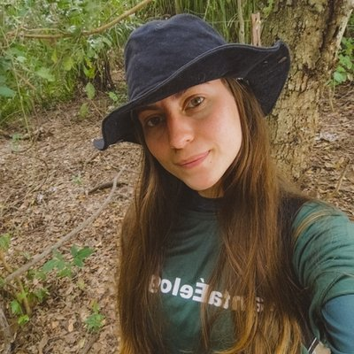

Beatriz Oliveira

Undergrad researcher

Independent research project (FUNDECT fellowship, 2025).

<a href="http://lattes.cnpq.br/3716194579932697" title="Lattes CV"><i class="ai ai-lattes"></i></a>

:::

:::

::: {.callout-note}
**Interested in joining the lab?** Read about
[opportunities to do research with us](opportunities.qmd).
:::

## Past members and co-advised students

::: {.people-grid}

::: {.person-card}
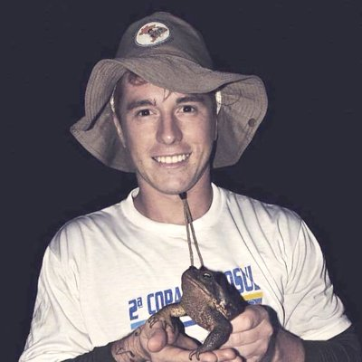

Marcos Rafael Severgnini

former PhD student · Ecologia e Conservação

Eco-evolutionary dynamics shaping frog phenotypic and
life-history traits along urban gradients.

<a href="http://lattes.cnpq.br/6261003504491115" title="Lattes CV"><i class="ai ai-lattes"></i></a>

:::

::: {.person-card}
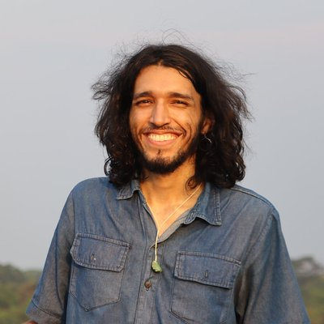

Leandro B. Menezes

Master's student · Ecologia e Conservação

Intra- vs. interspecific phenotypic variation of frogs
along urban gradients.

<a href="http://lattes.cnpq.br/1991879172038018" title="Lattes CV"><i class="ai ai-lattes"></i></a>

:::

::: {.person-card}
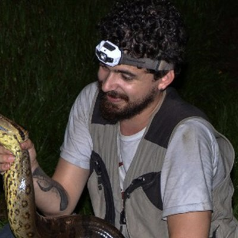

Dr. Matheus T. Moroti

Former PhD · Ecologia e Conservação

Evolutionary and ecological drivers of vertebrate diversity
in the Brazilian Atlantic Forest.

<a href="http://lattes.cnpq.br/3037868379750378" title="Lattes CV"><i class="ai ai-lattes"></i></a>

:::

::: {.person-card}
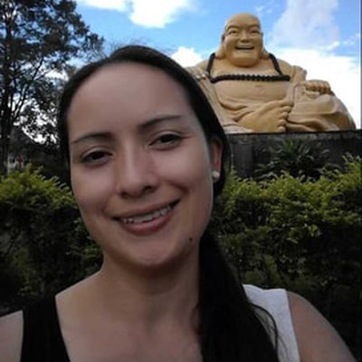

Dr. Adriana C. Acero-Murcia

Former PhD · Ecologia e Conservação

Ecomorphology of bat communities in the Bodoquena Plateau
using geometric morphometrics.

<a href="http://lattes.cnpq.br/2151570245603214" title="Lattes CV"><i class="ai ai-lattes"></i></a>

:::

::: {.person-card}
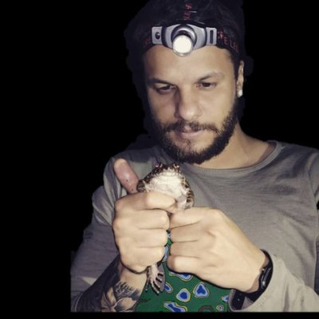

Dr. Philip T. Soares

Former PhD · Ecologia e Conservação

How multiple threats (Bd, invasive species) influence
distribution patterns of Neotropical frogs.

<a href="http://lattes.cnpq.br/9275923791121356" title="Lattes CV"><i class="ai ai-lattes"></i></a>

:::

::: {.person-card}
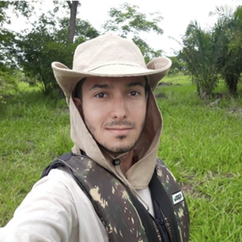

Gabriel Tirintan

Former Master's student · Ecologia e Conservação

Macroecology of urban bird diversity in Brazil using
citizen-science data (iNaturalist, eBird).

<a class="profile-link" href="http://lattes.cnpq.br/8861238387153166"> Lattes CV</a>

:::

::: {.person-card}
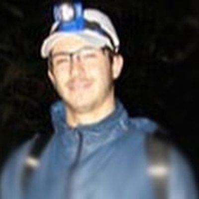

Daniel Din Negre

Former undergraduate

Tadpole community structure at Parque Natural Municipal
Nascentes de Paranapiacaba (SP).

:::

::: {.person-card}

Gabriela B. Leite

Former undergraduate

Comparative testis morphology in Neotropical anurans.

:::

::: {.person-card}
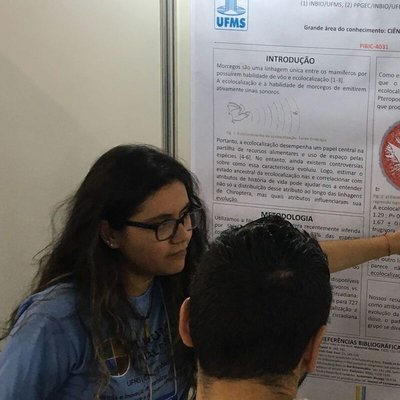

Laura Bonin

Former undergrad

Evolution of echolocation in bats worldwide using
phylogenetic comparative methods.

<a class="profile-link" href="http://lattes.cnpq.br/0590588262836363"> Lattes CV</a>

:::

::: {.person-card}
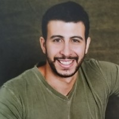

Pedro Abi-Rezik Barros Vianna

Former undergrad

Geographic variation in morphological traits and fitness
surface of the snake *Dipsas turgida*.

<a class="profile-link" href="http://lattes.cnpq.br/4802782044597460"> Lattes CV</a>

:::

:::
