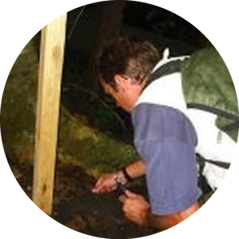
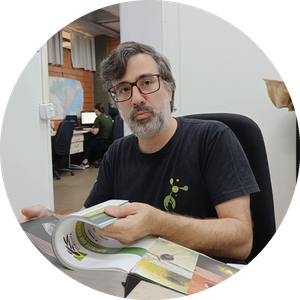
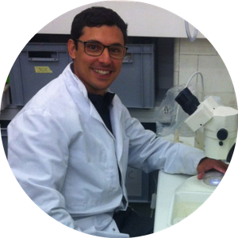

## Eco-evolutionary dynamics of urban biodiversity

*Understanding human impacts to improve human–wildlife coexistence.*

In March 2022 we received a grant (**Proc 407318/2021-6 — CNPq Universal**)
from the Brazilian National Council for Scientific and Technological Research
(CNPq) to investigate how frogs are responding to urban ecosystems in terms
of their phenotype. One Master's, one PhD, and one undergraduate student
conducting independent research collected data along urbanisation gradients
in three Brazilian cities — both at the **population** and **metacommunity**
scales. All of them have already presented their work at national and
international conferences. Stay tuned for more cool science about urban
frogs!

### Team

::: {.copi-grid}

::: {.copi-card}

Fernando R. da Silva

Co-PI · UFSCar

:::

::: {.copi-card}

Franco Souza

Co-PI · UFMS

:::

::: {.copi-card}

Michel V. Garey

Co-PI · UNILA

:::

::: {.copi-card}

Andros T. Gianuca

Co-PI · UFRN

:::

::: {.copi-card}

Fabio Angeoletto

Co-PI · UFR

:::

:::

## Funding history

- **2024 — FUNDECT research productivity grant.** Continued support for
  field work conducted by lab students.
- **2022–present — CNPq Universal** (Proc 407318/2021-6). Eco-evolutionary
  dynamics of urban biodiversity.
