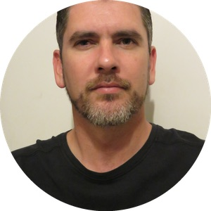
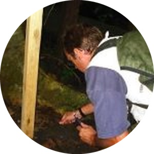
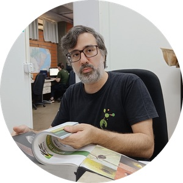
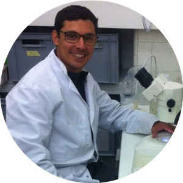

## Current projects

### Reconciling phenotypic evolution with metacommunity theory

Ongoing · Aug 2024 – Jul 2027

*Conciliando evolução fenotípica com o arcabouço teórico de metacomunidades:
perspectivas para uma nova síntese*

Funded by **FUNDECT** and **CNPq** through the Special Call Fundect/CNPq
15/2024 (Research Productivity fellowships; process 83/027.032/2024). The grant
combines a 36-month research productivity fellowship (Fundect PQ-2, equivalent
to CNPq PQ level E) with a research allowance for field work and consumables —
**BRL 75,600** in total.

The metacommunity framework explains species distributions through a handful
of archetypes that combine environmental heterogeneity, dispersal and
ecological equivalence. Rapid evolution of phenotypic traits, including in
response to human-altered environments, appears to be common, yet its role is
still poorly integrated into metacommunity theory. This project uses
**land-use gradients associated with urbanisation** as a natural template to
ask how phenotypic change feeds back into the dynamics of ecological
communities.

**Aims**

- Test how urbanisation reshapes the adaptive landscape of phenotypic traits
  that represent different dimensions of the niche.
- Quantify the relative contribution of ecology and evolution to trait
  divergence.
- Test how intra- and interspecific trait variation explain species
  distributions along urbanisation gradients in multiple landscapes.

**Approach.** Geometric morphometrics, phylogenetic comparative methods and
inference of adaptive (fitness) landscapes, linking trait variation to the
abundance, richness and distribution of species along environmental gradients
— and asking how changes in the distribution of fitness in open populations
scale up to metacommunity patterns.

**What we expect.** More urbanised environments should be more homogeneous and
constrain trait variation; urban populations should also be more isolated, so
that phenotypes fix faster under reduced gene flow — and, if those phenotypes
have low fitness, populations would be maladapted and prone to local
extinction. The results should help plan cities that work for both people and
biodiversity, and contribute to a "metacommunity 2.0" that integrates
phenotypic evolution with dispersal and niche selection.

### FrogNet — acoustic monitoring of frogs

Ongoing

*Principal investigator: Liliana Piatti. The lab participates as a
collaborator.*

FrogNet monitors frog vocalisations in the **Pantanal** and the **Cerrado**
with passive acoustic recorders and **BirdNET custom classifiers** trained to
recognise the calls of local species. Daiene L. Hokama Sousa's PhD applies
ecoacoustics and CNN-based species recognition to Pantanal frog
metacommunities within this project.

The validation step — deciding whether a classifier's detections can be
trusted — is handled by the lab's open
[BirdNET Validation Sampler](software.qmd#birdnet-validation-sampler).

## Completed projects

### Eco-evolutionary dynamics of urban biodiversity

*Understanding human impacts to improve human–wildlife coexistence.*

::: {.callout-note appearance="simple"}
**Project completed in March 2026.** The CNPq Universal grant that
funded this work has ended; papers stemming from it are still being
written and submitted.
:::

From **March 2022 to March 2026** (originally until 2025, then extended) we ran a CNPq Universal grant
(**Proc 407318/2021-6**) from the Brazilian National Council for
Scientific and Technological Research (CNPq) to investigate how frogs
are responding to urban ecosystems in terms of their phenotype. One
Master's, one PhD, and one undergraduate student conducting
independent research collected data along urbanisation gradients in
three Brazilian cities — both at the **population** and
**metacommunity** scales. All of them presented their work at national
and international conferences. Stay tuned for the papers coming out of
this project!

#### Team

::: {.copi-grid}

::: {.copi-card}

Fernando R. da Silva

Co-PI · UFSCar

:::

::: {.copi-card}

Franco Souza

Co-PI · UFMS

:::

::: {.copi-card}

Michel V. Garey

Co-PI · UNILA

:::

::: {.copi-card}

Andros T. Gianuca

Co-PI · UFRN

:::

::: {.copi-card}

Fabio Angeoletto

Co-PI · UFR

:::

:::

### Humboldt sabbatical at iDiv (2024–2025)

Completed

Diogo spent 2024–2025 as an **Alexander von Humboldt Research Fellow**
(Experienced Researchers) at the German Centre for Integrative Biodiversity
Research (**iDiv**), Leipzig. Talks from
the sabbatical — on urban ecology in the Global South and on the evolutionary
macroecology of the Atlantic Forest — are on the [Talks](talks.qmd) page.

## Funding history

- **2024–2027 — FUNDECT/CNPq research productivity grant** (Call 15/2024).
  Reconciling phenotypic evolution with metacommunity theory; fellowship plus
  research allowance for field work conducted by lab students.
- **2024–2025 — Alexander von Humboldt Foundation.** Research fellowship for
  experienced researchers and subsidy towards research costs for the
  sabbatical at iDiv.
- **2022–2026 — CNPq Universal** (Proc 407318/2021-6). Eco-evolutionary
  dynamics of urban biodiversity. *Concluded March 2026.*
